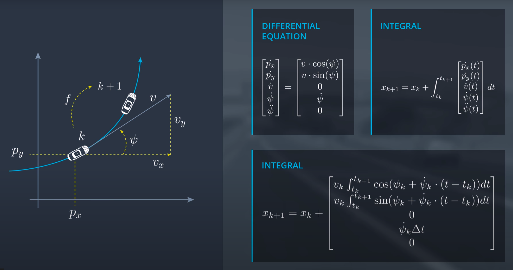
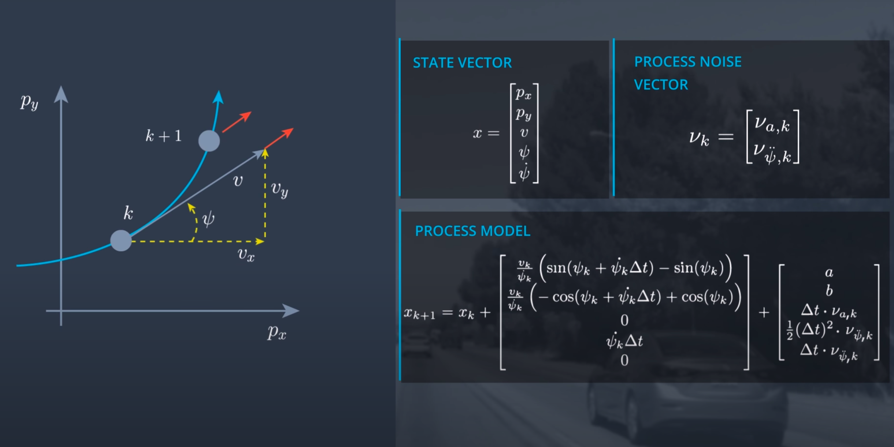
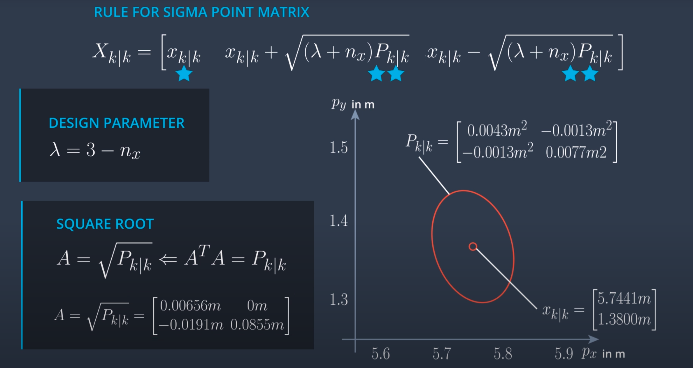
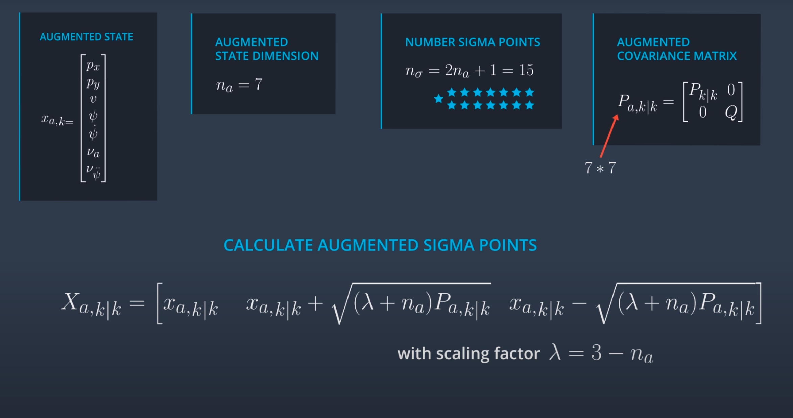
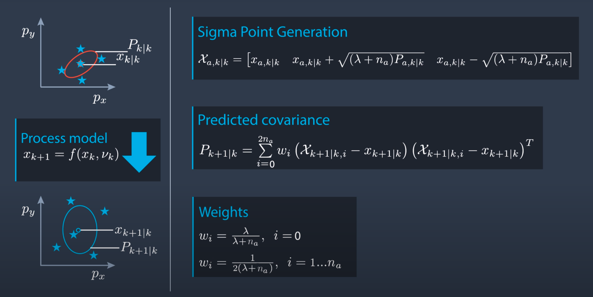
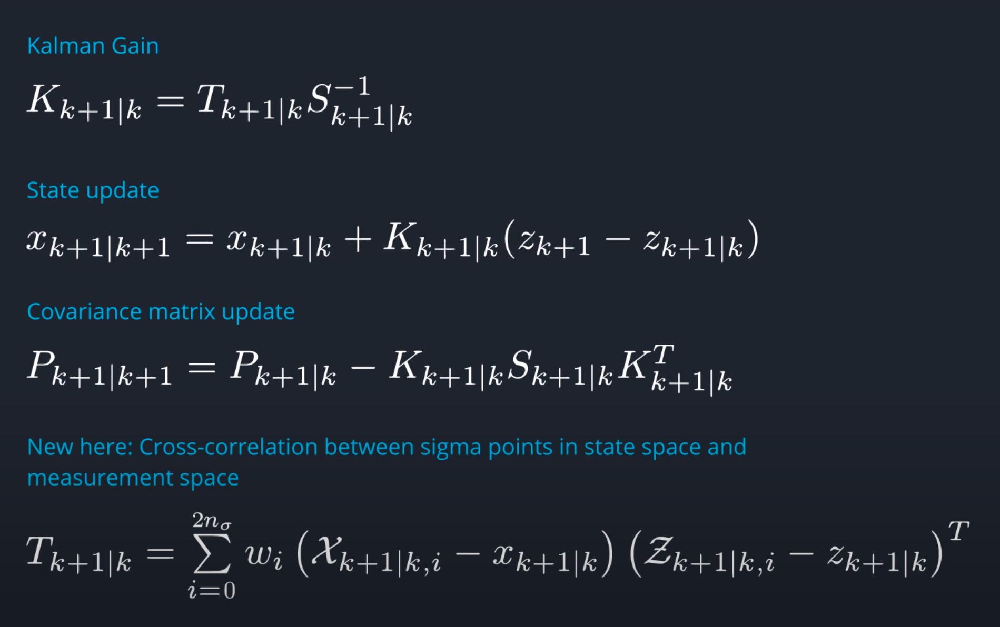

[](https://www.udacity.com/course/sensor-fusion-engineer-nanodegree--nd313)

# Udacity Nanodegree: Sensor Fusion

## Project 03: Unscented Kalman Filter


The red spheres above cars represent the (x,y) lidar detection and the purple lines show the radar measurements with the velocity magnitude along the detected angle. The Z-axis is not taken into account for tracking, so you are only tracking along the X/Y axis.

* The red spheres above the cars represent the (noisy) lidar detection cluster centroid.
* The purple lines show the radar measurements with the velocity magnitude along the detected angle.
* The green spheres show the UKF's estimation of the vehicle's current position, as well as its estimated position several timesteps into the future.


---
This project aims to develop a software stack that will enable us to achieve the following objectives.

```
1. We need to develop a constant turn rate and velocity magnitude model (CTRV) based motion model
2. Then we need to initialize the variables based on the first measurement
3. Based on the successive measurement we need to do the state prediction based on ```delta_t```
4. Simultaneously we need to take the measurement and need to find the ```best estimate``` of state using predicted state and measured state.
```
We are going to implement **Unscented Kalman Filter** to estimate the state of multiple cars on a highway using noisy lidar and radar measurements. The project pipeline can be broadly summarized by the following image.


To achieve our goal we need to complete the following four major tasks:
1. We are going to create a UKF object for every car in the lane
2. Then we will initialize the object's state vector and covariance matrix
3. We will also update other variables like augmented state vector, sigma point matrics, and weight matrics
4. Once we get the measurement we will call predict function with ```elapsed time & last state-space vector```
5. In prediction function, we will calculate the sigma points, and then based on the sigma points derive the mean and covariance matrix
6. Then based on the type of measurement we receive we will call the appropriate sensor function for update
7. The steps to update are identical for both the sensor except determining the states from the data.
8. We will calculate the Kalman gains and get the best estimate


`main.cpp` is using `highway.h` to create a straight 3 lane highway environment with 3 traffic cars and the main ego car at the center. 
The viewer scene is centered around the ego car and the coordinate system is relative to the ego car as well. The ego car is green while the other traffic cars are blue. The traffic cars will be accelerating and altering their steering to change lanes. Each of the traffic car's has
it's own UKF object generated for it and will update each one during every time step. 

---
## Other Important Dependencies
* cmake >= 3.5
  * All OSes: [click here for installation instructions](https://cmake.org/install/)
* make >= 4.1 (Linux)
  * Linux: make is installed by default on most Linux distros
* gcc/g++ >= 5.4
  * Linux: gcc / g++ is installed by default on most Linux distros
* PCL 1.2

### Basic Build Instructions

#### 1. First of all, clone this repo:
```
$ git clone git@github.com:Suraj0712/SFND_5_Unscented_Kalman_Filter_Highway_Project.git
```

#### 2. Run Quiz
```
$ cd <Path_to_quiz_directory>
$ makdir build && cd build
$ cmake ..
$ make
$ ./<executable_name>
```
#### 3. Run Project
```
$ cd <directory_where_you_have_cloned_the_repo>/SFND_5_Unscented_Kalman_Filter_Highway_Project/Project/
$ makdir build && cd build
$ cmake ..
$ make
$ ./<executable_name>
```

---
### Project Rubic
#### FP.1 Constant turn rate and velocity magnitude model (CTRV)
Many different models can be used to track the motion of the vehicle. In the implementation of  ```Kalman filter and Extended Kalman Filter```, we assumed the constant velocity model. The model will give a good estimate when the vehicle is following the straight line but the performance will be highly affected while turning. To better simulate this scenario we use the Constant turn rate and velocity magnitude model (CTRV) as our motion model. The state vector for the model is as follows

```
State vector = [ Position_in_x , Position_in_y , magnitude_of_velocity , yaw_angle , yaw_angle_change_rate ]

```

The following figure will give a better understanding of the state-space vector, integral to determine the next step and their respective derivations.
 


The issue with the above expression is when ```yaw_angle_change_rate``` is zero i.e. vehicle is going in a straight line we have to divide by zero which will return the error. To handle those cases we will have a special case. whenever the yaw_angle_change_rate is zero we will calculate the state-space by decomposing the velocity along x and y directions. Until now we are only considering the deterministic part and we need to add the stochastic part which we will introduce by adding Gaussian noise in linear and angular acceleration. after adding the stochastic part our model will look like as follow



```
a = 1/2 * (delta_t ^ 2) * cos(psi_k) * (linear_acc_noise)
b = 1/2 * (delta_t ^ 2) * sin(psi_k) * (linear_acc_noise)
```

#### FP.2 Sigma Point generation (Ukf Process model)
To deal with non-linear function ```UKF``` uses unscented transformation. In ```unscented transformation``` we use sigma points which are representative of the whole distribution. We transform sigma points to get the new mean and covariance matrics. The results we get from the UKF are not accurate but they are the best possible estimate. The derivation to get the sigma point looks crazy however, the intuition behind it is very simple. We sample point at some predefined ```sigma level``` along the positive and negative direction of every state in state-space vector and we also include the mean of distribution so in total we have **2 * Number_of_states + 1** sigma points. We can select different sigma levels to generate more points however, in that case, we need to deal with accuracy and time trade-off. Refer to this [implementation](https://github.com/Suraj0712/SFND_5_Unscented_Kalman_Filter_Highway_Project/tree/master/quiz/q6_generating_sigma_points) for the sigma point generation also take a look at the following image to get some idea on rules related to sigma point generation.



#### FP.3 State Augmentation to incorporate process noise (Ukf Process model)
So to get the next state we need to do the nonlinear transformation. The input to this nonlinear transformation is the current **states space vector and process noise vector**. While generating the sigma points we only considered the state-space vector however the process noise will also have a nonlinear effect and we need to account it to get a better estimate. In UKF it is achieved by state augmentation where we add the process noise in the states space vector and generate the sigma point for augmented states space vector.

```
Process_noise = [ gaussian_distributed_noise_for_linear_acceleration , gaussian_distributed_noise_for_angular_acceleration ]'
* Process_noise is independent of time

process_covariance = Process_noise * Process_noise'
* The diagonal element will be zero as linear and angular acceleration are independent of each other.
```

After accounting the process noise our sigma point generation step and covariance matrics will look as shown in the following picture. you can also take a look at my [implementation](https://github.com/Suraj0712/SFND_5_Unscented_Kalman_Filter_Highway_Project/tree/master/quiz/q7_state_augmentation) to get an in-depth understanding of the same.




### FP.4 Prediction of Sigma point (Ukf Process model)
Now we have a matrix that has 2*n+1 augmented states and ever state is of size n. We need to do nonlinear transformation Based on the model we derived for the ```CTRV``` (refer the second image in FP1) to predict the state of these points in the future. One thing we have to make sure is the output state-space vector will not have process noise values. you can also take a look at this [implementation](https://github.com/Suraj0712/SFND_5_Unscented_Kalman_Filter_Highway_Project/tree/master/quiz/q8_sigma-point_prediction) to understand the implementation detail. 

  
### FP.5 Calculating the mean and covariance for the predicted sigma points (Ukf Process model)
So far we took a distribution calculated the sigma points transform them to a new state and now we will do the inverse transformation to get the distribution properties. Now we need to find the characteristics of the distribution based on the predicted sigma points. We can calculate that using the following statistics formulae. as you can see in the image there is a weight term. This term signifies the relevance of ever sigma point on the distribution. The weights depend on the ```lambda``` which is dependent on the sigma levels we used for choosing the sigma points. here is my [implementation](https://github.com/Suraj0712/SFND_5_Unscented_Kalman_Filter_Highway_Project/tree/master/quiz/q9_mean_covariance_prediction)




### FP.6 Convert points into measurement space (Ukf measurement model)
The sensor measures some quantity and uses some transformation on the measured data to get the values associated with states. In this step, we will take our predicted point and convert them to the measurement space. After that, we will calculate the mean and covariance matrix for the data in measurement space. Now you might ask why are we predicting the points in measurement and state-space? The answer is to calculate the ```Kalman gains```. The implementation of the conversion of points to the measurement space can be found here [implementation](https://github.com/Suraj0712/SFND_5_Unscented_Kalman_Filter_Highway_Project/tree/master/quiz/q10_predict_mean_and_covariance%20_for_radar)

### FP.7 UKF update step
This is the first time we will need the measurement values as time elapsed was enough to calculate the predicted values. The update step gives us the best estimate of mean and covariance. To get those values we first need to calculate the Kalman gains, then state estimate and covariance estimate. The process looks similar to the normal Kalman filter update step except the complex Kalman gain variable. To calculate the Kalman gains we need to calculate the cross-correlation between predicted sigma points in the state space and predicted sigma points in the measurement space. you can take a look at the following image to see the formulas. For implementation click here [implememtation](https://github.com/Suraj0712/SFND_5_Unscented_Kalman_Filter_Highway_Project/tree/master/quiz/q11_ukf_update_step)



## Closing remarks
It's physically impossible to get 100% accurate readings and control inputs and that's why we have to rely on the filters to get the better estimate. All three filters that we discussed here are based on the Bayesian filter. 
* Kalman filter: This works well for the normally distributed measurements and predictions.
* Extended Kalman filter: This is an extension of the Kalman filter to handle the nonlinear cases. It uses the Taylor series expansion for local linearization and Jacobian matrix for estimation.
* Unscented Kalman filter: Performance of UKF is better than EKF and KF. It uses a sample-based approach to get the estimate of the states. when the distribution is highly nonlinear this is the best option.

## Thank you!!!
